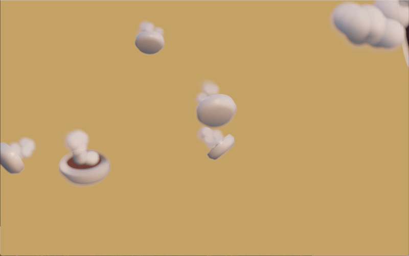

# 🥣 S.O.U.P. (Some Overly Unnecessary Project) 🥣

Ever felt like your life was missing a random, resource-hogging, visually bewildering piece of software? No? Well, too bad—here it is anyway!

Welcome to **S.O.U.P.**: a React + Vite extravaganza that simulates, um, soup. Yes, soup. Because we’re 100% sure the internet _needed_ another 3D, swirling, steam-puffing, GPU-melting soup scene.

## 🤔 But…Why Soup?

Because coffee, bananas, and cat poop have been done to death! We needed something fresh, hot, and definitely pointless—hence, **S.O.U.P.**

- S for _Some_
- O for _Overly_
- U for _Unnecessary_
- P for _Project_

No deeper meaning, no life-changing innovation. Just a swirling bowl, random puffs of steam, and code you might be tempted to rename and claim as your own.

## 🥄 Stirring the Pot: Features

- **Randomly Rotating Bowls**: Because linear movement is too mainstream.
- **Steam Puffs**: The ephemeral illusions of success. One moment they're here, the next they're off-screen.
- **3D Scenes**: Impress your friends, or at least your GPU fans.
- **Sarcasm**: Possibly the only genuine ingredient here.

## 🚀 How to Sauté This Code

1. **Clone**: `git clone https://github.com/davidyen1124/some-overly-unnecessary-project.git`
2. **Install**: `npm install` (some might call it _adding seasoning_).
3. **Cook** (Run): `npm run dev` (prepare for your fans to rev up).
4. **Open**: Visit the provided local URL. Bask in the glory of swirling soup.

## 🍜 See It Live

Because we’re feeling generous (and definitely not seeking short-lived fame), you can watch it [**here**](https://davidyen1124.github.io/some-overly-unnecessary-project/). Don’t worry, it’s _definitely_ not a clone of any other project. We promise. Pinky swear.

## 🔧 Tech Ingredients

- **React** (Because what’s more unnecessary than a component-based library for soup?)
- **Vite** (For that lightning-fast dev environment, if only our soup-lagging framerate matched…)
- **Three.js** (We love 3D, even if it’s 90% steam).
- **Sarcasm** (Your only real friend in a world of “We built everything from scratch, trust us!”).

## 👩‍🍳 Chef’s Notes

- This code might run slower than a snail in peanut butter, but at least it’s “original.” (Hello, fruit-themed AI startups. 👋)
- Performance disclaimers? Nah, we love watching GPUs cry.
- “Does it scale?” Absolutely… up to a whopping 10 bowls if you’re lucky.

## 😎 Why Bother?

We have absolutely no illusions of this changing the world. But hey, if **pear.ai** can pass off a cloned project as their own, maybe we’ll get into YCombinator with a steaming pot of soup. Dare to dream.

Enjoy!

— Made with zero shame and a heaping spoonful of sarcasm.
